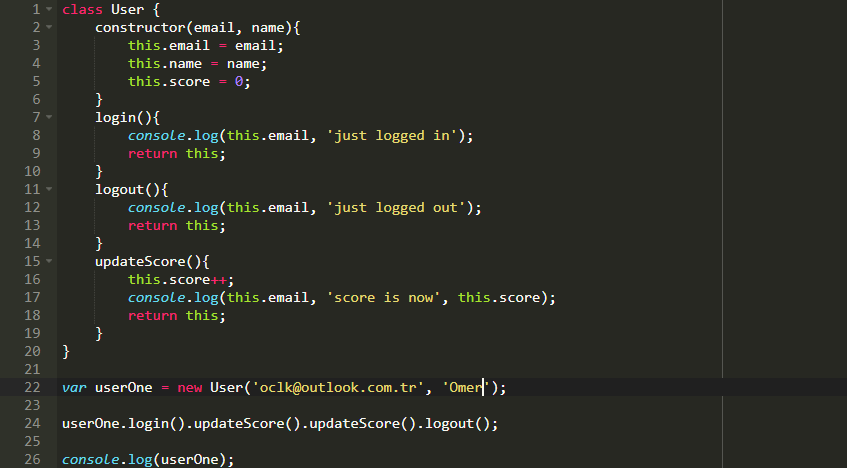

# vue-codeditor

Multi-language vue js code editor component running on the browser.

### Project setup
```
npm install vue-codeditor
```

### Usage
##### Import vue-codeditor component
```javascript
// main.js

import Vue from "vue"
import App from "./App.vue"
import vueCodeditor from "vue-codeditor";

Vue.component(vueCodeditor)
```
##### Usage in other components
```html
<!-- App.vue -->

<template>
  <div id="app">
    <!-- 
        * Can be used in the loop (for multiple editor components)
        * Each component must have its own content value.
    -->
    <vue-codeditor v-model="content" mode="javascript" theme="chrome" />

    <!-- 
        * If you want it to be readonly, you should use "readonly='true'" directly!
    -->
    <vue-codeditor v-model="content2" mode="html" theme="monokai" readonly="true"/>
  </div>
</template>

<script>
export default {
  name: "App",
  data() {
    return {
      content: "console.log('Hello world!')",
      content2: "<h1>Hello world!</h1>",
    };
  },
};
</script>
```
#### Available Props

| Prop| Default | Type | Description |
| :---: | :---: | :---: | :---:|
| ```mode``` | javascript | String | optional - [ace mode(s)](https://github.com/ajaxorg/ace/tree/master/lib/ace/mode) |
| ```theme``` | chrome | String | optional - [ace theme(s)](https://github.com/ajaxorg/ace/tree/master/lib/ace/theme) |
| ```readonly``` | false | Boolean | optional |

#### Sample pictures




#### Contributing
Pull requests are welcome. For major changes, please open an issue first to discuss what you would like to change.

Please make sure to update tests as appropriate.

#### License
[MIT](https://choosealicense.com/licenses/mit/)

Copyright (c) 2020-present, Ömer Çelik 